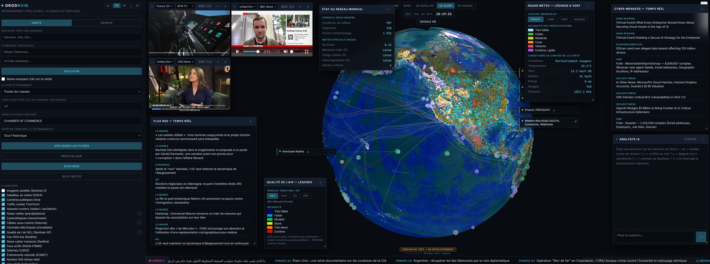
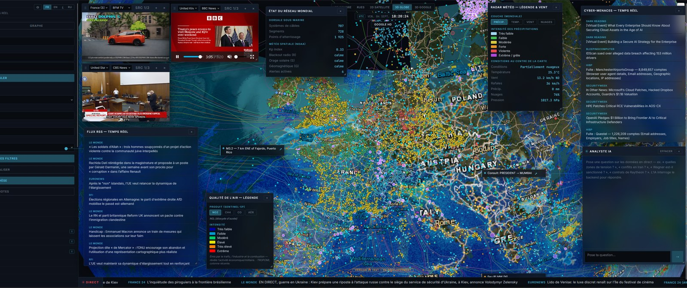
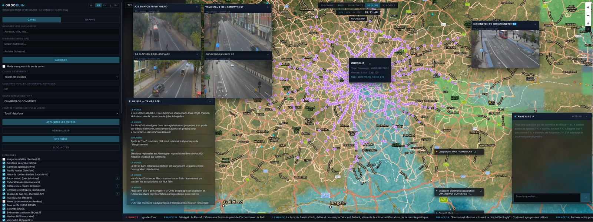
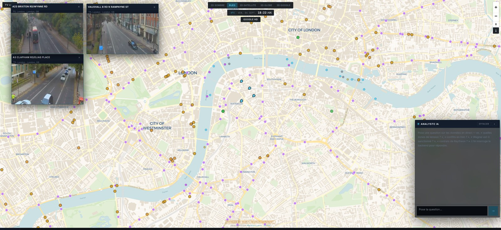

<div align="center">

# Orodruin

**Open-source intelligence — the whole world, live.**

A self-hostable alternative to Palantir Gotham. Orodruin fuses dozens of live global
data sources onto an interactive 2D/3D map and an actor graph, and ships an AI analyst
that queries every source **and drives the interface** — opens live cameras, recenters
the map, toggles layers, filters events, and grounds every answer in real data.

[](LICENSE)
[](https://orodruin.dev)
[](CONTRIBUTING.md)


**[🌍 Live demo — orodruin.dev](https://orodruin.dev)** · **[Contributing](CONTRIBUTING.md)** · **[Sponsor](https://github.com/sponsors/Dev-next-gen)**



**[▶ Watch the walkthrough (4 min)](docs/demo.mp4)**

</div>

> **In development.** Orodruin is a live, evolving project. Things move fast and some
> sources rate-limit or go dark without warning. Contributions, fixes and ideas are
> very welcome — see [Contributing](#contributing).

Everything runs on free/public APIs and any OpenAI-compatible LLM (the hosted demo
uses DeepSeek; you can point it at a local model, OpenAI, OpenRouter, Groq…).

---

## What it does

Orodruin pulls geopolitical events, disasters, live vessels and aircraft, thousands of
public cameras, cyber-threat feeds, submarine cables, power grids, weather and air
quality — all onto one map — then lets an AI analyst reason over the whole picture and
act on the UI for you.

| | |
|---|---|
|  |  |
| **3D globe over Europe** — event density under the live precipitation radar and submarine cables. | **London, live** — AIS vessels, TfL traffic cameras streaming, per-vessel intel on click. |
|  | Orodruin ships **five basemaps** — dark, streets, satellite, 3D globe and Google Photorealistic 3D — plus an **actor co-occurrence graph**: zoom, pan and click any actor to push its events onto the map. |
| **2D street basemap** — cameras, active fires and events at city scale. | |

## Features

**Map layers (toggleable)**
- Geopolitical events (GDELT) — global event feed with an actor ontology
- Active fires (NASA FIRMS) · Earthquakes (USGS) · Natural events (EONET) · Disaster alerts (GDACS)
- Live vessels (AISStream) · Live aircraft (OpenSky ADS-B) · Satellites in orbit (SGP4)
- ~6,700 public live cameras (TfL London, Caltrans, DriveBC, NZTA, Finland Digitraffic, DIR Est, Windy) with a multi-format player (MP4 / HLS / refreshing JPEG / iframe)
- Road hazards (TomTom incidents + OSM speed cameras) · Traffic flow tiles (TomTom)
- Weather radar (RainViewer) · Planet-wide weather (OpenWeatherMap) · Air quality NO₂/CH₄/CO/Aerosol (Sentinel-5P / Copernicus)
- Cyberattacks (ransomware.live) · Submarine cables + landing points (TeleGeography) · Power plants (WRI, ~35k)
- Satellite imagery (Sentinel-2 / Copernicus) · Google Photorealistic 3D Tiles

**Actor graph** — a co-occurrence network built from the event stream: two actors are
linked when they appear together in events. Node size = connections, edge width =
frequency, colour = country. Zoom, pan, and click any actor to see its connections and
push its events straight onto the map.

**Windows & panels** (draggable/resizable) — global network status, weather legend +
wind, air-quality product selector, live RSS feed, cyber-threat news + global breach
tracker (HIBP), notepad, route planner (TomTom), screenshot tool.

**Sidebar tools** — sanctions screening (OFAC + OpenSanctions), cyber exposure (Shodan),
IP geolocation, US federal contracts (USASpending), research monitoring (ArXiv),
financial markets (Yahoo/CoinGecko), prediction markets (Polymarket), tension hotspots,
live alert feed.

**AI analyst** — an LLM with tool access to every source. It grounds answers in real
data, cross-references sources, draws deductions, and acts on the UI (`open_camera`,
`area_intel`, `focus_map`, `toggle_layer`, `apply_filters`, …). Serious,
intelligence-terminal tone — no emojis.

Available in **English, French, Arabic (RTL) and Russian**.

## Architecture

- **backend/** — FastAPI + SQLAlchemy 2.0 + psycopg (PostgreSQL 16), ~57 routes.
  Live sources are proxied server-side so API keys never reach the browser. Ingesters
  (`app/ingest/`) load GDELT, FIRMS, GDACS, AIS, OFAC/OpenSanctions, ACLED. GZip on all
  JSON responses.
- **frontend/** — React 18 + Vite + MapLibre GL (+ Cesium for Google 3D, hls.js for cameras).
- **LLM** — any OpenAI-compatible endpoint. The demo runs DeepSeek (`deepseek-chat`);
  set the base URL, model and key in the in-app **Settings ⚙** panel, or in `.env`.

## Self-hosting

```bash
git clone https://github.com/Dev-next-gen/orodruin.git orodruin
cd orodruin

# 1. Database
docker compose up -d db

# 2. Backend
cd backend
cp .env.example .env          # fill in your free API keys (see the file)
python -m venv .venv && . .venv/bin/activate
pip install -r requirements.txt
python -m app.ingest.run --once   # initial data load (loops with --loop 900)
uvicorn app.main:app --host 0.0.0.0 --port 8000

# 3. Frontend
cd ../frontend
npm install
npm run dev                   # dev server; or `npm run build` for production
```

The frontend proxies `/api` to the backend (see `vite.config.js`). Most sources work
with no key at all; each key in `.env.example` links to where you get it for free.

### Public / production mode

Set `PUBLIC_MODE=true` in `backend/.env` before exposing Orodruin to the internet. It:
- hides the Settings ⚙ panel and rejects any API-key or LLM change over HTTP,
- rate-limits the AI analyst (`CHAT_RATE_PER_MIN`, default 8/min per IP) so visitors
  can't burn your LLM credit.

## Security

- **No secrets in the repo.** All keys live in `backend/.env`, which is gitignored.
  Use `backend/.env.example` as the template.
- The only key exposed to the browser is `GOOGLE_MAPS_KEY` (required client-side by
  Google Maps) — restrict it by IP/referrer in the Google Cloud Console.
- Orodruin uses **only legal, public sources.** It does not touch criminal leak forums;
  data-breach intelligence comes from Have I Been Pwned.

## Contributing

Orodruin is open to pull requests, improvements and ideas. Bug fixes, new data sources,
new analyst tools, translations, performance and UX work are all welcome. See
**[CONTRIBUTING.md](CONTRIBUTING.md)** to get started. Open an issue first for anything
large so we can align.

## Support the project

If Orodruin is useful to you, you can support its development via
**[GitHub Sponsors](https://github.com/sponsors/Dev-next-gen)**. Sponsorship keeps the
hosted demo online and funds work on new sources and analysis.

## License

Orodruin is licensed under the **GNU Affero General Public License v3.0** — see
[LICENSE](LICENSE). In short: you are free to use, study, modify and self-host it, but
if you run a modified version as a network service you must publish your source under
the same license. Created and maintained by **Léo Camus / NextGen Labs**.

## Data sources

GDELT · NASA FIRMS · USGS · NASA EONET · GDACS · AISStream · OpenSky · Windy ·
TfL / Caltrans / DriveBC / NZTA / Fintraffic / DIR Est · TomTom · OpenStreetMap ·
RainViewer · OpenWeatherMap · Open-Meteo · Copernicus CDSE (Sentinel-2 / Sentinel-5P) ·
NOAA SWPC · TeleGeography · WRI Global Power Plant Database · ransomware.live ·
Have I Been Pwned · OFAC · OpenSanctions · Shodan · ip-api · USASpending · ArXiv ·
Yahoo Finance · CoinGecko · Polymarket · iptv-org · dozens of news RSS feeds.
